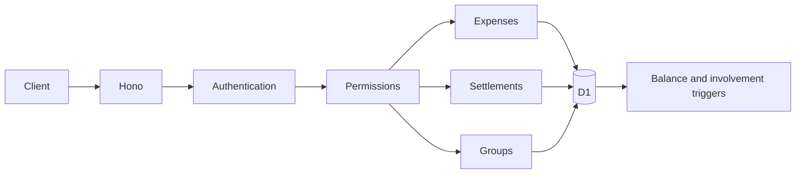

# Expense sharing API — approved design

Approved by the user on 2026-09-21. Implementation is confined to the expense-core worktree; deployment is separate.

## 1. Scope

Build a backend API on Cloudflare Workers with Hono, existing D1 and Better Auth. Support registered Google users, exact email lookup, optional groups, expenses, settlements, balances and financial audit history. No frontend feature work, invitations, payment processing, conversion, recurring expenses, receipts or cross-person debt simplification.

## 2. Architecture

One Worker, small domain modules and direct parameterized SQL. Hono is the only added runtime dependency. Native Node tests and Miniflare exercise the real Worker and D1. Existing balance and involvement triggers remain authoritative projections. Every financial mutation and its audit event commits atomically through D1 batch; write-time predicates enforce ownership, membership and optimistic versions inside the transaction.

## 3. Identity and access

Resolve verified Google subjects through user_identities to durable users. Never use email as identity or accept a caller identity from request JSON. Retain encrypted cookie sessions; copied cookies cannot individually be revoked. Profile refresh comes only from verified provider data, never old cached profile claims. Require a verified email for registration. Exact lookup trims whitespace and ignores case without stripping dots or plus suffixes. Ambiguous matches return a conflict, never account merging. Authenticated lookup returns ID, name and avatar, with a durable per-user rate limit.

Expense creators must pay or share, and must be current members of the destination group. Financial participants may be outside that group. Creator only can edit/delete. Readers are the creator, financial participants and current members of its current group. Personal feed includes created, paid and shared expenses; group feed includes all group expenses. Users see only their own global balances.

Either payer or recipient can record a settlement; it takes effect immediately. Only its recorder can edit/delete. Both parties can view it. No group membership reveals unrelated balances or settlements.

Any registered user may create a group and becomes owner. Owner alone manages settings/members and deletes the group; other members may leave. Owner cannot leave; ownership transfer is deferred. Membership changes do not change debt. Historical memberships remain. Deleting a group detaches expenses rather than deleting them. This is the approved exception to creator-only expense organization changes. Creators who leave can still correct/delete their expenses, but cannot move an expense into an inaccessible group.

## 4. Money and corrections

CAD and USD only. Amounts are positive integer cents within JavaScript safe integer bounds, including cumulative balances. Multiple payers must sum to the total. Exact shares must sum to the total. Equal split distributes remainder cents to sorted user IDs; reject fewer cents than participants because shares must be positive. Duplicate users within a list are rejected, but a user may occur in both lists. Compute net paid minus share; sort debtors and creditors by ID and greedily match positive amounts. Persist allocations; database triggers update pair balances.

Overpayments and payments without debt are allowed; the balance may reverse. Settlements are independent of individual expenses and groups. Editing/deleting an expense after settlement adjusts the debt while leaving payments unchanged. Expense currency is immutable. Settlement payer, recipient and currency are immutable. Correct these by deletion and recreation. Expense editing replaces payments, shares and allocations atomically. Dates require timezone-bearing timestamps; backdating is allowed, future dates rejected. No zero/negative expenses, refunds or credits.

## 5. API contracts

Existing /api/auth/*, /api/me and /api/health remain. API payloads use camelCase, amountMinor and currencyCode. Dates use ISO timestamps at the API boundary and milliseconds in D1. IDs are UUIDs. Every error includes a stable error code, message and requestId. Lists return {items,nextCursor}. Default page size 25, maximum 100; cursors encode ordering keys and query scope. Financial feeds order by financial date descending then ID descending. Inaccessible records return 404.

| Routes | Purpose |
|---|---|
| POST /api/users/lookup | Exact email lookup |
| GET, POST /api/expenses | Personal feed/create |
| GET, PUT, DELETE /api/expenses/:id | Read/replace/delete |
| GET /api/expenses/:id/history | Authorized audit history |
| GET, POST /api/settlements | Personal feed/create |
| GET, PUT, DELETE /api/settlements/:id | Read/correct/delete |
| GET /api/settlements/:id/history | Both parties' audit history |
| GET /api/balances | Caller's currency-separated pair balances |
| GET, POST /api/groups | Membership list/create |
| GET, PATCH, DELETE /api/groups/:id | Read/settings/delete |
| GET, POST /api/groups/:id/members | List/add |
| DELETE /api/groups/:id/members/:userId | Owner removal/self leave |
| GET /api/groups/:id/expenses | Shared group feed |

Financial creation requires Idempotency-Key. Scope keys to actor and resource type. Store the original request fingerprint and response durably, including after deletion. Same key/input returns original response; changed input returns 409. Fingerprint normalized semantic input. Edits/deletes use quoted numeric If-Match versions; missing returns 428, stale returns 412. Versions protect all editable aggregates, including group membership.

## 6. Data changes and audit

Add an incremental migration: versions on expenses, settlements, groups; normalized email index; financial audit history with before/after snapshots, actor/action/time, and idempotency metadata; durable lookup rate counters. Existing migration is not rewritten. Audit event identities do not reference deleted financial rows. Keep audit/retry history indefinitely in this version.

Financial history survives deletion. Creator can read all expense revisions; historical participants can read only snapshots in which they were involved. Current group members see only snapshots belonging to that group, so moving an expense must not expose its previous standalone history. When a revision has before/after snapshots with different permissions, redact each separately. Both settlement parties can see its full history. Ordinary feeds omit deleted records.

## 7. Safety and operation

Use prepared bindings for all user input. JSON-only writes, same-origin protection for cookie-authenticated writes, private no-store responses, structured redacted error logs, request IDs, body/participant/page bounds. Proposed implementation bounds: 64 KiB request body; 50 distinct expense participants; 200-character descriptions/group names; 1000-character settlement notes; lookup 30/minute/user. Preserve financial arithmetic correctness at the safe integer boundary through integer calculations and database balance guards. A failed batch must leave no partial record, allocations or audit event. Read-time multi-statement snapshots use a read batch.

Read health is public; financial operations return 503 on unavailable D1. Unexpected failures return generic 500 without SQL, secrets or personal payloads. Enable Worker logs/traces. Keep existing OAuth secrets in Wrangler secrets and .dev.vars. No production resource creation or deployment in this task. New migration is additive; rollback application code only when compatible with new history/version behavior. Back up before production migration; do not undo money by dropping audit tables.

## 8. Verification and decisions

Test first: stable identity, impersonation rejection, exact lookup, permissions, membership revocation, rounding, multiple payers, safe money boundaries, currency separation, overpayment, correction after settlement, history redaction, duplicate/replayed creates, stale/concurrent edits and rollback. Run typecheck, build, relevant tests, git diff review. No lint tool currently exists: use available TypeScript diagnostics and whitespace checks, report that limitation rather than install one silently.

Decisions: one Worker/direct SQL rather than ORM/services; pair balances rather than cross-person optimization; immediate trust-based settlements rather than approval; immutable currency/endpoints rather than relabeling debt; durable snapshots/retry metadata rather than physical loss of deleted history. These preserve the existing model while making financial writes explainable and safe.

Sources verified: https://hono.dev/docs/getting-started/cloudflare-workers ; https://developers.cloudflare.com/d1/worker-api/d1-database/ ; https://better-auth.com/docs/concepts/session-management .
